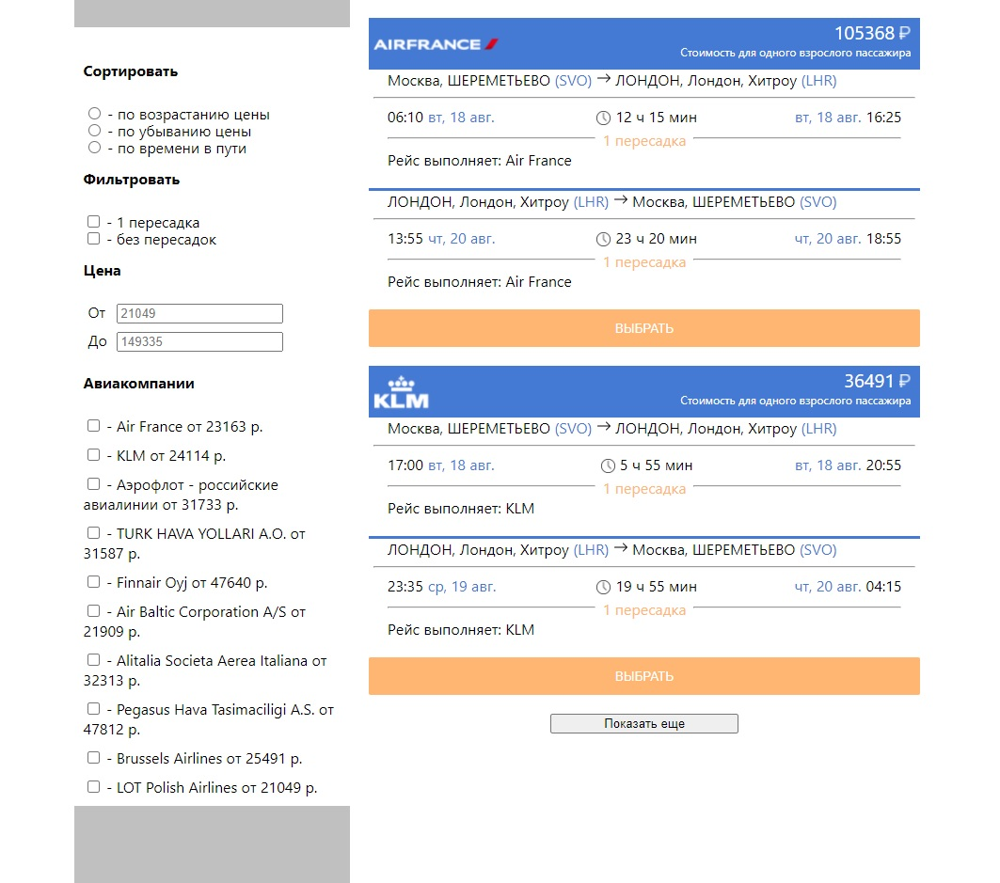

# Cтраница результатов поиска перелётов

### На странице отображаются карточки перелётов, присутствует блок с фильтрами и сортировками.
### Фильтрация и сортировка строятся на основании данных файла flights.json.
### Предусмотрена фасетная фильтрация с динамическим состоянием фильтров.
### При создании использовались технологии: React, Redux, React-Redux, Css Modules.
### Просмотр работы кода: https://yuliyabaskakova3012.github.io/avia-search-app/

<<<<<<< HEAD

=======

>>>>>>> ca3a2333a7cad5672fb4f3a73fef75e75fc2a158
