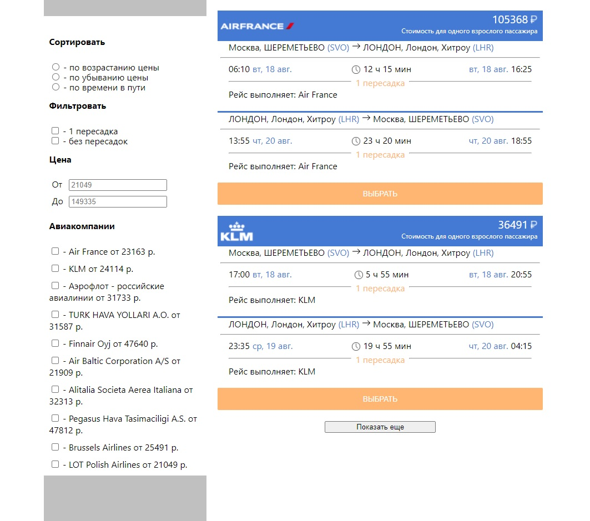

# Cтраница результатов поиска перелётов

### На странице отображаются карточки перелётов, присутствовует блок с фильтрами и сортировками.
### Фильтрация и сортировка строятся на основании данных файла flights.json.
Предусмотрена фасетная фильтрация с динамическим состоянием фильтров.
При создании использовались технологии React, Redux, React-Redux.

